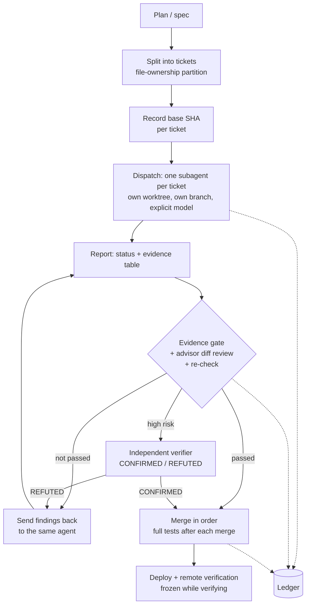

# advisor-dispatch — an advisor/dispatch workflow for Claude Code

> One advisor window. Many subagents, each with its own context, its own git worktree and a model you choose per ticket. Nothing merges without evidence.

[](LICENSE)
[](#)

- 繁體中文版：[README.zh-TW.md](README.zh-TW.md)
- Core flow (what Claude Code loads): [`skills/advisor-dispatch/SKILL.md`](skills/advisor-dispatch/SKILL.md)

---

## Problem and goal

Running several coding agents in parallel usually fails in the same few ways, none of which
is about code quality:

- two agents edit the same file, and the conflict only shows up at merge time;
- an agent reports "done" with a pasted `1 passed` that does not test the stated requirement;
- a dispatched agent goes idle and nobody notices, or two agents end up in one working tree;
- a long session gets compacted and the orchestrator forgets which tickets were already finished.

advisor-dispatch is a **process contract**, not a framework. The main session acts as the
*advisor*: it splits work into tickets, dispatches one subagent per ticket in an isolated
worktree, checks a per-ticket evidence table, reads every diff itself, and merges in order.
It never writes implementation code.

> **What this does not claim.** We have not measured a speed-up or a defect-rate reduction.
> What exists is one recorded end-to-end run (see [Validation](#validation)) and a list of
> what has not been tested yet (see [Limitations](#limitations-and-future-work)).

---

## Core features

**What you work with**

- **One window.** You talk to a single advisor session. It splits the work, dispatches, reviews
  and reports back; you do not manage the subagents yourself.
- **An independent context per subagent.** A ticket prompt carries only that ticket, the
  interfaces it touches and the global constraints, not the whole session history. The advisor's
  context stays free for coordination and review.
- **An isolated worktree per implementer.** One ticket, one worktree, one branch; the advisor
  never edits code in them. (A recovery agent can be put back into an existing worktree; the
  independent verifier reads the repo read-only.)
- **A model per ticket.** The advisor sets `model` explicitly on every dispatch, so you can mix
  levels in one run: lighter for low-risk mechanical edits, the default for ordinary work, stronger for
  high-risk or vague tickets. Escalation happens on evidence (`BLOCKED` because the task is too hard, or the same finding
  sent back twice and still not fixed). The ledger records the model, level and review rounds of every ticket, so you can
  compare what each choice cost in send-backs. The skill does not aggregate that and does not
  record token cost.

**What keeps it safe to run in parallel**

- **File-ownership partitioning.** A file belongs to exactly one ticket in a parallel batch;
  tickets that must share a file run in series. Worktrees stop working trees from colliding,
  but not merge conflicts; ownership does.
- **Evidence table per ticket.** One row per acceptance criterion with the exact command, exit
  code and observed output. A row marked `UNVERIFIED` blocks the merge unless a named
  structural-dependency exception applies.
- **Advisor re-check, not trust.** The advisor reads the diff against a recorded base SHA and
  reruns every high-risk acceptance item itself.
- **Independent verifier for high-risk tickets.** A fresh-context, adversarial reviewer that
  judges only (`CONFIRMED` / `REFUTED`) and never edits code.
- **Patrol and recovery rules.** Judge agent state from commits and `git status`, not from
  self-report; never put a second agent into a worktree unless the first has stopped.
- **Append-only ledger.** One line per event, with numbered dispatch attempts
  (`ticket-N#aK`), so a compacted session can recover instead of re-dispatching finished work.
- **Flow contract for multi-step work.** Every seam between steps is assigned to a named
  ticket before any ticket is dispatched.

---

## How it works



| Role | Who | Responsibility |
| --- | --- | --- |
| Advisor | the current main session | plan, split, review, merge, watch the deploy; writes no implementation code |
| Implementer | subagent, `model` set explicitly per ticket | works only inside its ownership list, commits to its branch, never pushes |
| Verifier | fresh subagent (or an external model CLI), level ≥ implementer | adversarial read-only check of high-risk tickets |

---

## Requirements and fallbacks

The core flow needs git, Claude Code's Agent tool (with `isolation: "worktree"` and `model`),
and Bash. Everything else is "use it if present, otherwise use the fallback":

| Capability | If present | If absent |
| --- | --- | --- |
| `SendMessage` | findings go back to the original agent | dispatch a new agent only after the old one has stopped |
| `ListAgents` | liveness checks | infer from worktree activity; if unsure, treat it as alive |
| Scheduled wake-up | patrol every ~10 minutes | patrol on every interaction and tell the user |
| External model CLI | verifier from another model family | fresh subagent at the advisor's level |

The full table is at the top of `SKILL.md`.

---

## Install

**A. Copy into a skills directory**

```bash
# personal, all projects
mkdir -p ~/.claude/skills && cp -R skills/advisor-dispatch ~/.claude/skills/
# or one project only
mkdir -p <project>/.claude/skills && cp -R skills/advisor-dispatch <project>/.claude/skills/
```

A skill is a folder with a `SKILL.md`, so you can edit it to match your own conventions
(commit style, test commands). Restart the Claude Code session; the skill is triggered by its
description, for example "dispatch this work".

**B. Plugin (installs and updates with commands)**

```
/plugin marketplace add Chuanyin1202/advisor-dispatch
/plugin install advisor-dispatch@advisor-dispatch
```

**C. `npx skills` (one command)**

```bash
npx skills add Chuanyin1202/advisor-dispatch -a claude-code -s advisor-dispatch
```

Installs into the project the command is run in.

---

## Usage

```
Use dispatch mode to build: an order-export API (CSV) and a matching front-end button.
Split tickets first and show me the file-ownership partition; I'll approve before you dispatch.
Use the default model for implementation, opus for the security-related ticket, and add a verifier to that one.
```

The advisor writes a plan and a ticket table, waits for your approval, records the base SHA,
dispatches the tickets in one message, patrols, collects evidence tables, reviews and
re-verifies each ticket, merges in order, and asks before pushing.

Templates: [`templates/ticket.md`](skills/advisor-dispatch/templates/ticket.md) and
[`templates/evidence-table.md`](skills/advisor-dispatch/templates/evidence-table.md).

---

## Validation

One end-to-end run in a throwaway repository, installed at project level and driven by a
single `claude -p` session. The task was two unrelated functions (`add`, `mul`), one ticket
each. Checked afterwards from the repository itself, not from the agent's report:

- two feature commits and two merge commits on `main`; `git worktree list` shows only `main`
- `8 tests ... OK` after the last merge
- no file touched outside a ticket's ownership list

Ledger lines from that run, verbatim:

```
ticket-1#a1 dispatching
ticket-1#a1 dispatched (model=sonnet, worktree=pending, base=3f3b49acebf99e6a99202b840aa6b14793b1c215)
ticket-1 merged (0e945f1badad10bc38ed75e496726dd3634a0440); worktree removal pending
ticket-2 merged (8b7a54eb7039f1e7ed4e1a8d00d99709d174c47e); full suite 8 tests OK
```

The run exposed real frictions, fixed in v1.1.1: the worktree path is unknown at
dispatch time (and chosen by the tool), `git worktree remove` needs `--force` for untracked
build artifacts, there was no ledger location when the repo has no `.gitignore`, and
non-behavioral acceptance items had no stated way to be re-checked. Before the run, the text
had gone through two independent reviews by a second model (translation fidelity, then
internal contradictions); both rounds' findings were fixed.

**Install paths** (each in a clean environment, files compared with `diff -r` against this repo):
manual copy, the plugin from the GitHub `owner/repo` source (`claude plugin list` shows it
enabled), and `npx skills@1.7.0 add Chuanyin1202/advisor-dispatch` from the GitHub source.

---

## Limitations and future work

**Measured or observed**

- **Only one live run, two tickets.** Anything beyond a small, clean task is untested.
- **Not exercised in that run:** the fix loop (resuming a finished agent with `SendMessage`),
  the patrol (the tickets were too short to need one), the verifier, and the deploy step.
- **Triggering from an installed copy** (plugin or `npx skills`) was not run; only the
  project-level copy was driven end to end. Other agents supported by `npx skills` are untested.
- **Fallback paths** (no `SendMessage` / `ListAgents` / scheduler) are written down, not run.
- **The recovery agent into an existing worktree** relies on the agent obeying a path rule,
  because the Agent tool has no parameter to reuse a worktree. A leak check is required and
  that route is untested.
- **No enforcement.** There are no hooks or scripts; the red lines are reminders for the
  advisor, not a mechanism.
- **Deliberately heavy.** For a change that fits in one ticket, just do it directly.

**Future work**

1. Run the fix loop, the patrol and the verifier on a real multi-ticket task.
2. Drive a full run from a plugin install and from an `npx skills` install.
3. Optional hooks that enforce the cheapest red lines (no push without consent).

---

## Repository layout

```
.claude-plugin/                plugin.json, marketplace.json
skills/advisor-dispatch/
├── SKILL.md                    core flow (what Claude Code loads)
├── references/
│   ├── evidence-table.md       evidence rules and the structural-dependency exception
│   ├── verifier.md             verifier contract, model selection, convergence rules
│   └── ledger.md               ledger format and the three terminal states
└── templates/
    ├── ticket.md
    └── evidence-table.md
```

`references/` and `templates/` are read only when `SKILL.md` points to them.

---

## License

MIT. See [`LICENSE`](LICENSE). Copyright (c) 2026 Chuanyin1202.
