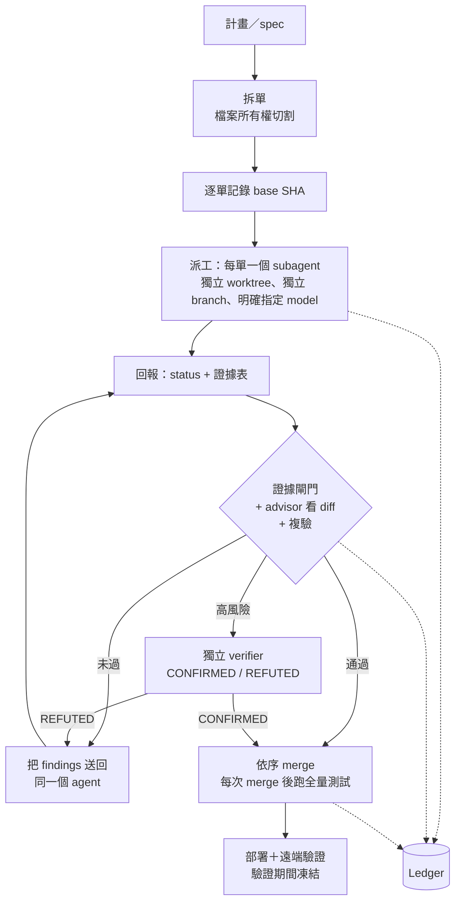

# advisor-dispatch — Claude Code 的派工／監工開發流程

> 一個 advisor 視窗。多個 implementer subagent，各自有獨立 context、獨立 git worktree，並且每張工單可以選不同模型。沒有證據就不能 merge。

[](LICENSE)
[](#)

- English：[README.md](README.md)
- 核心流程（Claude Code 實際載入的檔案）：[`skills/advisor-dispatch/SKILL.md`](skills/advisor-dispatch/SKILL.md)

---

## 問題與目標

同時跑多個 coding agent，常見的失敗幾乎都和程式碼品質無關：

- 兩個 agent 改到同一個檔案，衝突要到 merge 才爆；
- agent 回報「完成」，貼了一行 `1 passed`，但那個測試根本不是在驗你要的需求；
- 派出去的 agent 閒置沒人發現，或兩個 agent 進了同一棵工作樹；
- 長 session 被壓縮後，主 session 忘了哪些工單已經做完，又重派一次。

advisor-dispatch 是一份**流程合約**，不是框架。主 session 當 *advisor*：拆單、每張單派一個
subagent 進獨立 worktree、檢查每張單的證據表、親自看每一份 diff、依序 merge。advisor 自己不寫實作碼。

> **不宣稱的事**：我們沒有量到「速度提升 X%」或「缺陷率下降 X%」，也不打算宣稱。
> 目前只有一次完整的實跑紀錄（見[驗證](#驗證)），以及一份尚未測試項目的清單（見[限制與未來工作](#限制與未來工作)）。

---

## 核心功能

**你實際面對的**

- **只有一個視窗。** 你只跟一個 advisor session 對話；它負責拆單、派工、review 與回報，
  你不需要自己管理各個 subagent。
- **每個 subagent 有獨立 context。** 工單 prompt 只帶該張工單、會碰到的介面與全域約束，
  不貼完整的 session 歷史；advisor 的 context 留給協調與審查。
- **每個 implementer 有獨立 worktree。** 一張工單一個 worktree、一個 branch，advisor 不在裡面改 code。
  （recovery agent 可以回到既有的 worktree；獨立 verifier 以唯讀方式看 repo。）
- **每張工單可選模型。** advisor 每次派工都明確指定 `model`，同一次執行可以混用檔位：
  低風險的機械式修改用較輕的、一般工作用預設、高風險或規格模糊的用較強的。升級依據是證據
  （`BLOCKED` 且任務太難，或同一個 finding 退回兩次仍未修好）。ledger 會記錄每張工單的模型、檔位與 review 輪數，
  方便你比較各種選擇換來多少次退回；skill 本身不彙整，也不記錄 token 成本。

**讓平行執行不出事的機制**

- **檔案所有權切割**：同一批平行工單中，一個檔案只屬於一張單；必須共用檔案的工單改串行。
  worktree 只防工作樹互踩，防不了 merge conflict，所有權才防得了。
- **每張工單一份證據表**：每條驗收標準一列，附完整指令、退出碼、實際輸出。標為 `UNVERIFIED`
  的列會擋住 merge，除非符合具名的「結構相依」例外。
- **advisor 複驗，不是信任**：advisor 以記錄下來的 base SHA 看 diff，並親自重跑所有高風險驗收項。
- **高風險工單加獨立 verifier**：fresh context、對抗式，只判定（`CONFIRMED`／`REFUTED`），不改 code。
- **巡視與恢復規則**：用 commit 與 `git status` 判斷 agent 狀態，不看自述；第一個 agent 沒有確定停止前，
  不得讓第二個 agent 進同一棵 worktree。
- **只追加的 ledger**：每個事件一行，派工有編號（`ticket-N#aK`），session 被壓縮後能靠它復原，不會重派已完成的單。
- **多步驟流程先產流程契約**：步驟之間的每個接縫，先指派給具名工單才開工。

---

## 運作方式



| 角色 | 誰 | 職責 |
| --- | --- | --- |
| Advisor | 目前的主 session | 規劃、拆單、review、merge、盯部署；不寫實作碼 |
| Implementer | subagent，每單明確指定 `model` | 只動所有權清單內的檔案，commit 到自己的 branch，不 push |
| Verifier | fresh subagent（或外部模型 CLI），階級 ≥ implementer | 對高風險工單做對抗式唯讀檢查 |

---

## 前置條件與備援

核心流程只需要 git、Claude Code 的 Agent tool（能指定 `isolation: "worktree"` 與 `model`）、Bash。
其餘都是「有就用、沒有走備援」：

| 能力 | 有的話 | 沒有的話 |
| --- | --- | --- |
| `SendMessage` | findings 送回原 agent | 原 agent 確定結束後才能補派新 agent |
| `ListAgents` | 確認 agent 是否還活著 | 靠 worktree 活動推斷；不確定就當它還活著 |
| 排程喚醒 | 約每 10 分鐘巡視 | 每次互動時巡視，並告訴用戶 |
| 外部模型 CLI | 用不同模型家族當 verifier | 改用 advisor 同級的 fresh subagent |

完整對照表在 `SKILL.md` 開頭。

---

## 安裝

**A. 複製到 skills 目錄**

```bash
# 個人全域
mkdir -p ~/.claude/skills && cp -R skills/advisor-dispatch ~/.claude/skills/
# 或只給某個專案
mkdir -p <專案>/.claude/skills && cp -R skills/advisor-dispatch <專案>/.claude/skills/
```

skill 就是一個含 `SKILL.md` 的資料夾，可以直接改成自己的慣例（commit 格式、測試指令）。重開 Claude Code session 後，用描述觸發，例如說「幫我派工做這件事」。

**B. Plugin（用指令安裝與更新）**

```
/plugin marketplace add Chuanyin1202/advisor-dispatch
/plugin install advisor-dispatch@advisor-dispatch
```

**C. `npx skills`（一行指令）**

```bash
npx skills add Chuanyin1202/advisor-dispatch -a claude-code -s advisor-dispatch
```

會裝進執行指令所在的專案。

---

## 使用範例

```
幫我用派工模式做：新增訂單匯出 API（CSV）與對應的前端按鈕。
先拆單、給我看檔案所有權切割，我同意再派。實作用預設模型，安全相關那張用 opus 並加 verifier。
```

advisor 先產計畫與工單表，等你同意後記 base SHA、同一則訊息派出各單、巡視、收證據表、
逐單 review 並複驗、依序 merge，最後問你能不能 push。

範本：[`templates/ticket.md`](skills/advisor-dispatch/templates/ticket.md)、
[`templates/evidence-table.md`](skills/advisor-dispatch/templates/evidence-table.md)。

---

## 驗證

在一個用完即丟的 repo 做了一次完整實跑：專案層級安裝，由單一 `claude -p` session 驅動。
任務是兩個互不相干的函式（`add`、`mul`），每個一張工單。事後直接檢查 repo 本身，不信 agent 的回報：

- `main` 上有 2 個 feature commit 與 2 個 merge commit；`git worktree list` 只剩 `main`
- 最後一次 merge 後 `8 tests ... OK`
- 沒有檔案被改到工單所有權清單之外

這次實跑的 ledger（原文）：

```
ticket-1#a1 dispatching
ticket-1#a1 dispatched (model=sonnet, worktree=pending, base=3f3b49acebf99e6a99202b840aa6b14793b1c215)
ticket-1 merged (0e945f1badad10bc38ed75e496726dd3634a0440); worktree removal pending
ticket-2 merged (8b7a54eb7039f1e7ed4e1a8d00d99709d174c47e); full suite 8 tests OK
```

實跑暴露了幾個真實的摩擦點，已在 v1.1.1 修正：派工當下不知道 worktree 路徑（路徑由工具決定）、
未追蹤的 build 產物會讓 `git worktree remove` 需要 `--force`、repo 沒有 `.gitignore` 時沒有 ledger 的位置、
非行為型驗收項沒有說明怎麼複驗。實跑之前，文字另經第二個模型兩輪獨立審查（先查翻譯忠實度，再查內部矛盾），
兩輪的發現都已修正。

**安裝路徑**（各在乾淨環境測試，並用 `diff -r` 與本 repo 比對檔案）：手動複製、
從 GitHub `owner/repo` 來源安裝 plugin（`claude plugin list` 顯示 enabled）、
以及從 GitHub 來源執行 `npx skills@1.7.0 add Chuanyin1202/advisor-dispatch`。

---

## 限制與未來工作

**已知且觀察到的限制**

- **只有一次實跑、兩張工單。** 比這更大或更髒的任務都沒測過。
- **這次實跑沒走到的部分**：修正迴圈（用 `SendMessage` 喚醒已完成的 agent）、巡視（工單太短不需要）、
  verifier、部署步驟。
- **從已安裝的副本觸發**（plugin 或 `npx skills`）沒有跑過；端到端只用專案層級的副本驅動過。
  `npx skills` 支援的其他 agent 也沒測。
- **備援路徑**（沒有 `SendMessage`／`ListAgents`／排程）只寫成文字，沒有實際跑過。
- **recovery agent 進既有 worktree** 靠 agent 遵守路徑規則，因為 Agent tool 沒有沿用 worktree 的參數；
  必須做洩漏檢查，且這條路未測試。
- **沒有強制機制。** 沒有 hook 或腳本；紅線是給 advisor 的提醒，不是機制。
- **刻意偏重。** 一張工單就能做完的改動，直接做就好。

**未來工作**

1. 在真實的多工單任務上跑修正迴圈、巡視與 verifier。
2. 從 plugin 安裝與 `npx skills` 安裝的副本各跑一次完整流程。
3. 用選用的 hook 強制最便宜的紅線（未經同意不得 push）。

---

## Repo 結構

```
.claude-plugin/                plugin.json, marketplace.json
skills/advisor-dispatch/
├── SKILL.md                    核心流程（Claude Code 實際載入）
├── references/
│   ├── evidence-table.md       證據規則與「結構相依」例外
│   ├── verifier.md             verifier 合約、模型選擇、收斂規則
│   └── ledger.md               ledger 格式與三種終態
└── templates/
    ├── ticket.md
    └── evidence-table.md
```

`references/` 與 `templates/` 只有在 `SKILL.md` 指到時才會讀。

---

## 授權

MIT，見 [`LICENSE`](LICENSE)。Copyright (c) 2026 Chuanyin1202。
